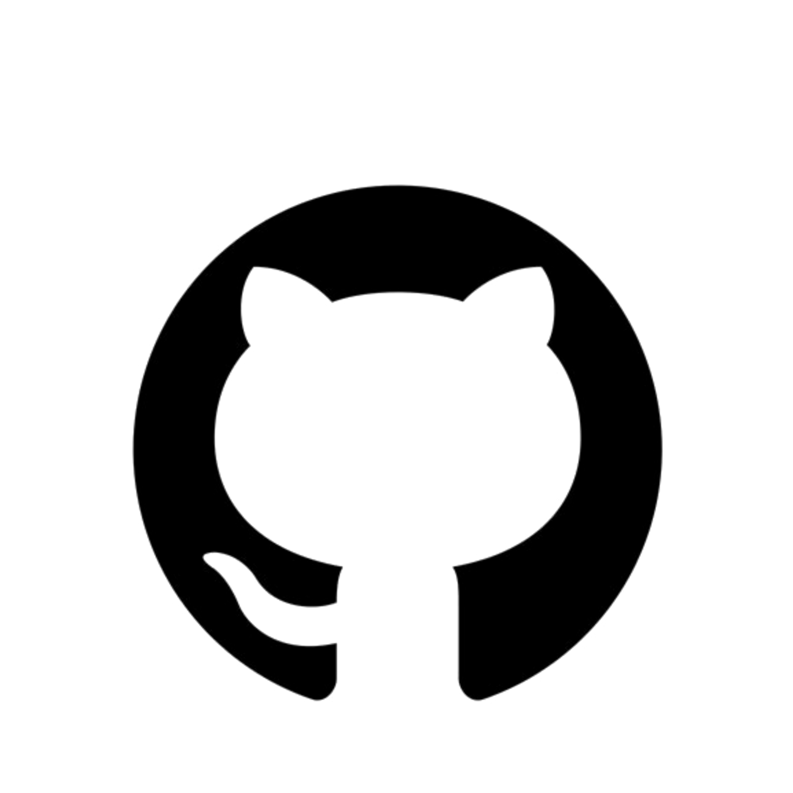

# Welcome to Darken Pasiya Github Profile&nbsp;</a>

   

<!---
Darken-Pasiya/Darken-Pasiya is a ✨ special ✨ repository because its `README.md` (this file) appears on your GitHub profile.
You can click the Preview link to take a look at your changes.
--->

  

   

 

 

### KNOW MORE ABOUT ME>>>>

   

 

<h3 align="center">

 

 
 

   

   

  

    
&#127942 <b>GitHub Awards</b>
 

    
&#127942 <b>GitHub Activity</b>
 

 

 

